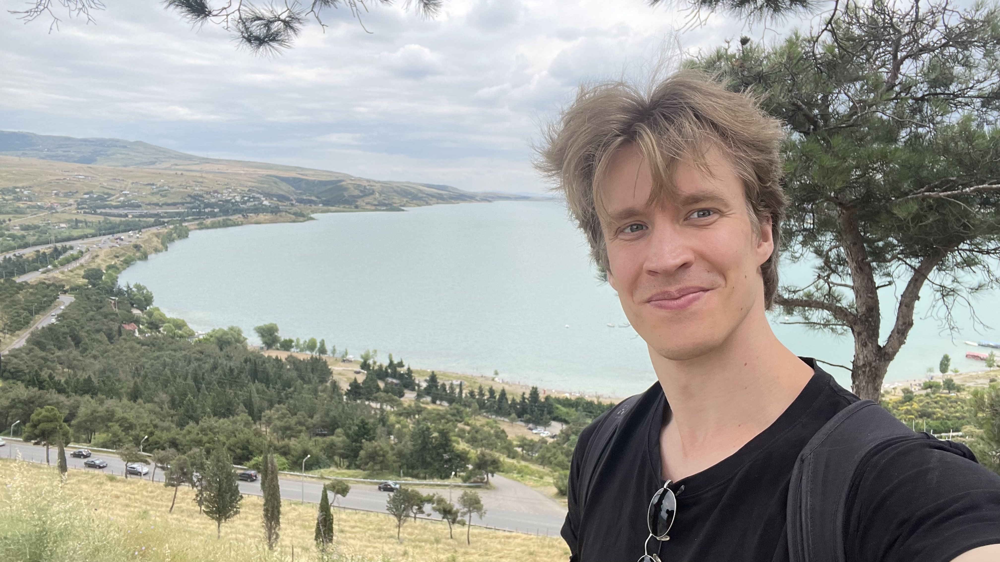
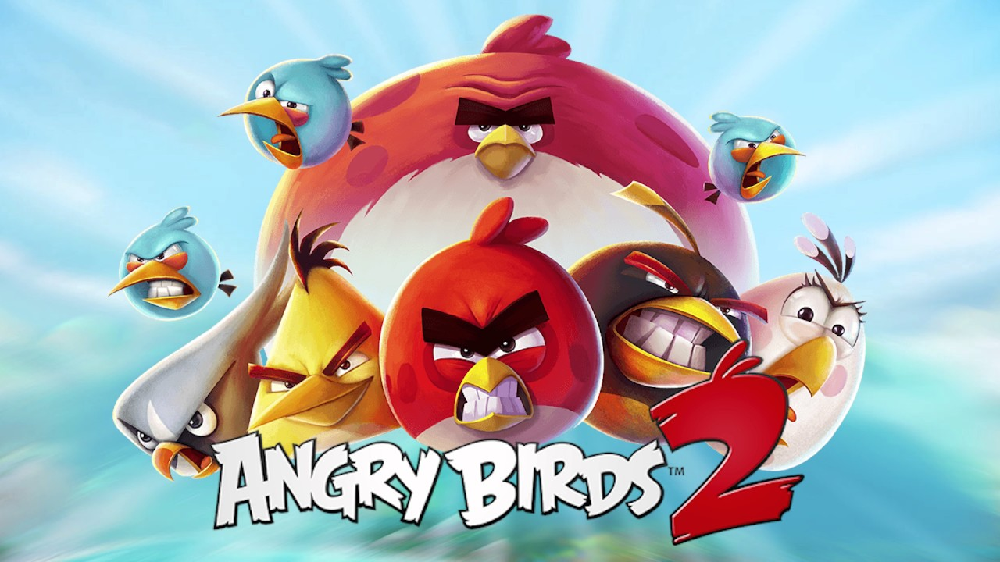
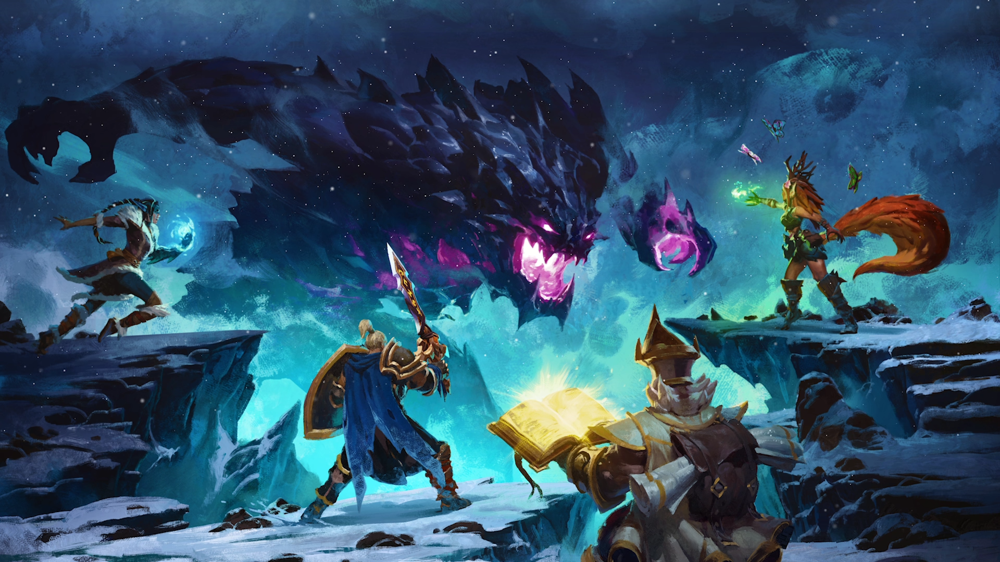

## Becoming a Gameplay Programmer
I realized in 2022 that I really want to work as a Game Programmer.
 
## My work as a Producer
**Angry Birds 2 (2017- 2021)**

In 2017 I began working as a Producer at Rovio Stockholm, doing live-ops and development of new updates on Angry Birds 2. 
 From the start of 2019 until my departure I was the only producer on the ~30 person project. My responsibilies of process, team growth and delivery of updates. 

 **Fellowship (2021- 2022)**

In 2021 I started as a Producer at Chief Rebel, with similar foucs on the game in development [Fellowship](https://www.playfellowship.com/en/). I was the only producer on the project that had a team size of around 40 people at the time of my departure.